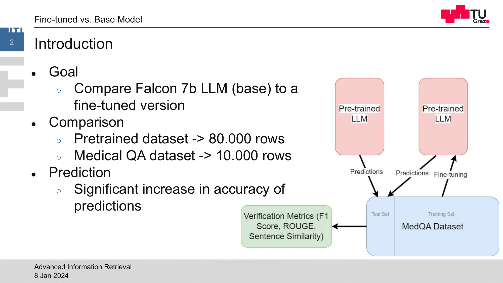
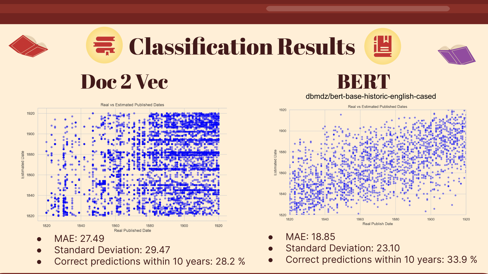
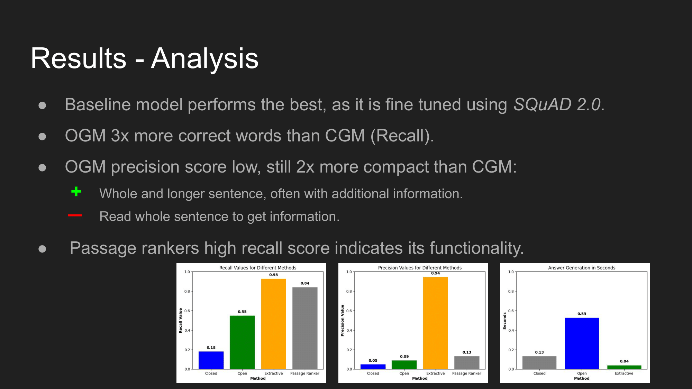
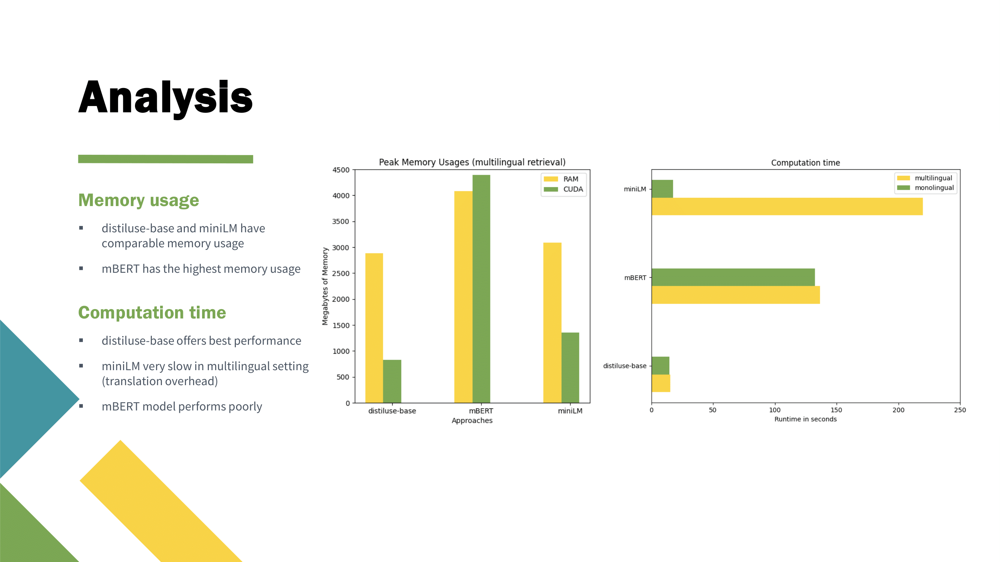
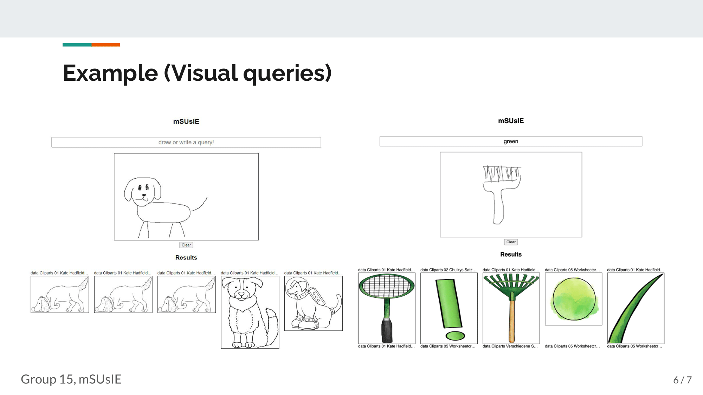

# Advanced IR WS23 Project Highlights

This page features well-conducted IR projects from Advanced Information Retrieval of winter term 2023 (in no particular order).  
Slides of the groups' final presentations and their code bases are openly available.  

## Out-of-the-box performance Compare a pretrained DPR model vs. fine-tuning a model
> Luke Leimbach  
> Joseph Juri  
> Raphael Kandler  

[Slides](files/group05.pdf) and Repo: [https://github.com/Azgeb/Advanced-Information-Retrival-WS23-24-Group05](https://github.com/Azgeb/Advanced-Information-Retrival-WS23-24-Group05)

## LTM: Language Time Machine
> Felix Holz  
> David Wildauer  
> Leopold Magurano  

[Slides](files/group11.pdf) and Repo: [https://github.com/NeXTormer/LTM-LanguageTimeMachine](https://github.com/NeXTormer/LTM-LanguageTimeMachine)

## IR Meets LLM
> Stephan Bartl  
> Dorian Percic  

[Slides](files/group04.pdf) and Repo: [https://github.com/stephba/IR-meets-LLM](https://github.com/stephba/IR-meets-LLM)

## Comparing Different Approaches to cross-lingual Information Retrieval
> Katharina Aschauer  
> Maximilian Binder  
> Jan-Peter Svetits  

[Slides](files/group02.pdf) and Repo: [https://github.com/katasc22/AIR2023](https://github.com/katasc22/AIR2023)

## mSUsIE: multimodal Search Using Image Encoders
> Benedikt Kantz  
> Corinna Kindlhofer  

[Slides](files/group15.pdf) and Repo: [https://github.com/coki1405/mSUsIE](https://github.com/coki1405/mSUsIE)

